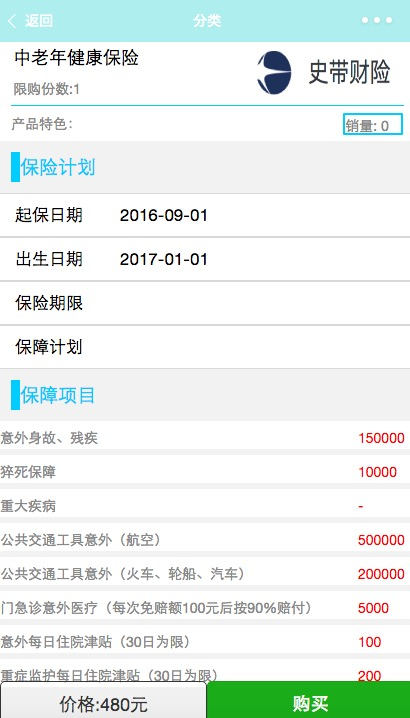
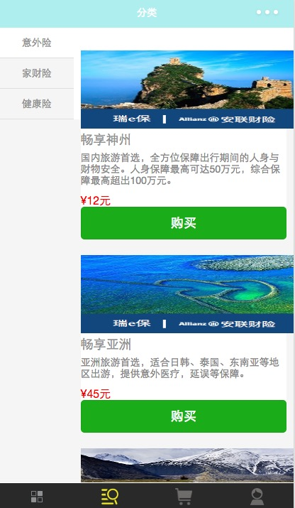

# 微信小程序实现保险产品商城
### 项目说明：
微信小程序：实现保险产品购买流程包裹一些
###### 常用到的效果
日期选择、模态框、下拉框选择、数字输入框、字符串输入框
###### 还有方法的封装
get post请求的封装

[数据来源：环球小镇（微信公众号：环球小镇），特此感谢]

### 目录结构：
- images — 存放项目图片
- utils — 存放服务层文件，主要实现和后端交互

### 项目截图:

### 项目地址：
https://github.com/TimLiu1/wechatApp.git
